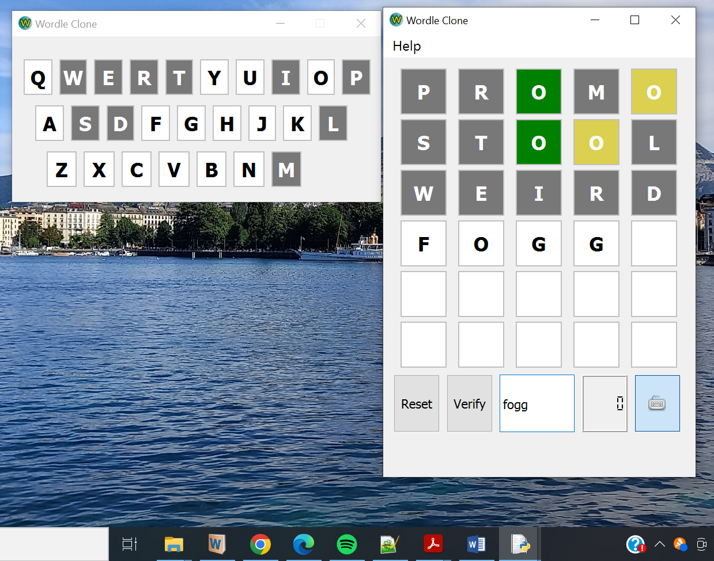

# Wordle Clone Unlimited PyQt5
   This is a clone of the globally famous game: Wordle.

## How to play
Full instructions on how to play are located at [Wordle by New York Times](https://www.nytimes.com/games/wordle/index.html)
## Developing
1. Add functionality to save score and progress
2. Add functionality to display progress statistics
3. Add functionality that allows users to select their list of English words.
## Screenshot

###### AUTHOR
Forwah Amstrong Tah, Ph.D. <lmsoftware2023@gmail.com>

